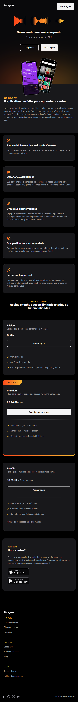
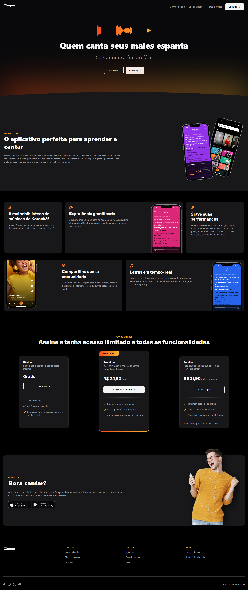

# 🚀 LP de Produto

## 📌 Descrição

Landing page responsiva de um produto, desenvolvida com base no layout do [Figma](https://www.figma.com/community/file/1371886246180677672/lp-de-produto).

Criada com foco em boas práticas de desenvolvimento: HTML semântico, responsividade com Bootstrap 5 e estrutura organizada para fácil manutenção.

## 🎯 Objetivo

Exercitar:

- Estruturação de páginas com HTML5
- Estilização responsiva com Bootstrap 5
- Organização de componentes e layout
- Recriação fiel de layout do Figma

## 🛠️ Tecnologias Utilizadas

- **HTML5**
- **CSS3**
- **Bootstrap 5**

## 💻 Preview




## 📷 Layout Figma

[Figma - LP de Produto](https://www.figma.com/community/file/1371886246180677672/lp-de-produto)

## ▶️ Como rodar localmente

1. Clone o repositório:

```bash
git clone https://github.com/LucasValada/LP-Produtos.git
Acesse o diretório do projeto:

cd LP-Produtos

Abra o arquivo index.html no seu navegador.

Você pode simplesmente dar um duplo clique no index.html, ou usar uma extensão como Live Server no VS Code para ver atualizações em tempo real.
```
